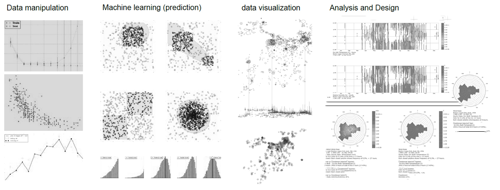

# Introduction to *Data Science* for *Building Simulation* Harvard JTerm

- Instructor: Jung Min Han, MDes, Harvard GSD
 
- Date: Jan 9-12 , 2017 
 
- Time: 1:00 - 3:00 p.m.
 
- Location: 20 Sumner/Room 1-D 

As green technology and energy are becoming more frequently integrated into architectural designs, the need to support architects with environmental analysis tools is growing. However, many of these tools require advanced knowledge of specific device and energy in order for users to conduct environmental studies. Furthermore, to increase accuracy of analysis, complicated equations and data management skills are adapted that requires numerous parameters. The emphasis on data management and adaptation to simulation engine has become popular allowing parametric studies and visual analysis.

Communicable data transfer techniques between architecture modeling tools and building simulation engines are becoming important. Rhinoceros and Grasshopper are one of the most widely used modeling tools by architects with visual communication. It allows users to work with various energy modeling add-on tools such as DIVA and LadyBug. By introducing these tools with introduction of data manipulation skills, students will be able to easily apply environmental analysis to their own design with adequate assumptions. Additionally, well-managed parameters will allow multiple iteration to be run with a single file.

The goal of this course is to introduce data management skills with simple scripting and informal critical parameters for building simulations. The workshop will focus on data process workflow from weather data to building data and visual representation of the data. This will help reduce the computational burden during the simulation and lead parametric studies with tuning parameters.

Basically, the course consists of four days, including lecture and workshop per each section. We will discuss the course objectives and concentrations at the first meeting based on the individual interests.  

#### Day 1 
- Lecture : Building simulation and data science
- Workshop : understanding and manipulating weather data   
- Tool: python, Jupyter notebook

#### Day 2 
- Lecture : Data processing of collected real data and simulated data
- Workshop : data processing (imputing missing values, cleaning data)
- Tool : python and jupyter notebook 

#### Day 3 
- Lecture : Parametric studies in building simulation
- Workshop : how to create multiple parameters in building simulation 
- Tool : python, jupyter notebook, EnergyPlus

#### Day 4 
- Lecture: Data visualization in building simulation 
- Workshop: plotting simulated data(notebook), visualizing energy data(grasshopper), web viz. 
- Tool : python and jupyter notebook , grasshopper, javascript, d3, mapbox 

When considering the limited time, I encourage you to participate in the preparation for the course.
For those who are not familiar with python, I recommend to do the python tutorial, [Codecademy](https://www.codecademy.com/learn/python). 
Even if you do not have experience in python or other programming language, you could follow the workflow during the workshop. 

For the software needed, [python 2 for GH](http://www.food4rhino.com/app/ghpython), [Anaconda](https://www.continuum.io/downloads)(64bit, version 2.7x), Rhino and [Grasshopper](http://www.rhino3d.com/download/grasshopper/1.0/wip), EnergyPlus ,and [Eabbit](https://www.dropbox.com/s/t0dvc8apsbfxx07/EabbitForBuildingEnergySimulation_V_0%2C0%2C1.zip?dl=0) are necessary. Try install them before the class, otherwise come to class early to setup them.

#### Reference
[An Introduction to Statistical Learning Sixth Printing.pdf](http://www-bcf.usc.edu/~gareth/ISL/ISLR%20First%20Printing.pdf)

[Data-Science-from-Scratch-First-Principles-with-Python.pdf](http://choonsiong.com/public/books/Data%20Science%20from%20Scratch.pdf)

[Interactive Data Visualization for the Web.pdf](https://robot.bolink.org/ebooks/Interactive%20Data%20Visualization%20For%20The%20Web.pdf)

